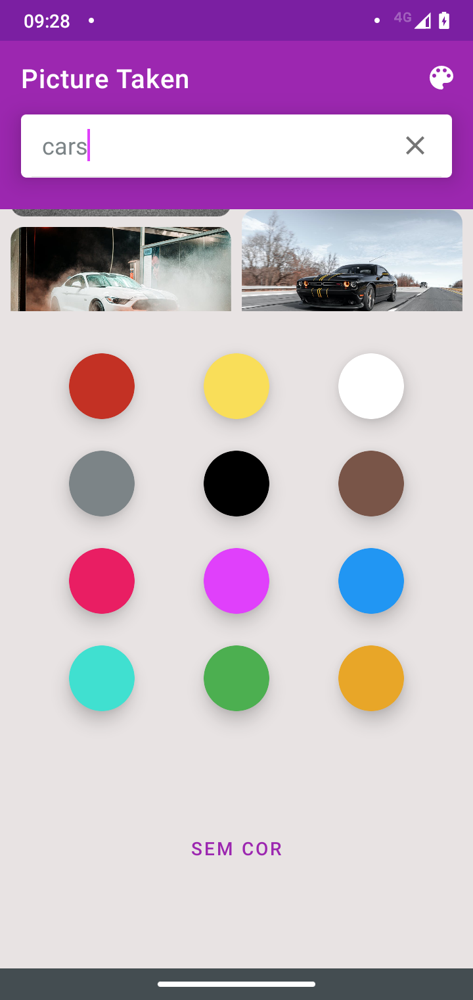

# pictureTaken
É um aplicativo de busca de imagens diversas disponibilizadas pela api da [Pexel](https://www.pexels.com/api/documentation/).


<p align="left">
   &nbsp;&nbsp;
   &nbsp;&nbsp;
  &nbsp;&nbsp;
  &nbsp;&nbsp;  
  
</p>


Faça o clone deste repositório:
```bash
git clone https://github.com/Kdiaseng/picture-taken-app.git
```

## Tecnologias utilizadas
- Arquitetura MVVM;
- DataBinding;
- Retrofit2;
- Navigation component;
- Injeção de depência **KOIN**
- Bottom Sheet
- Selead class
- Picasso

## API
https://www.pexels.com/api/documentation/


